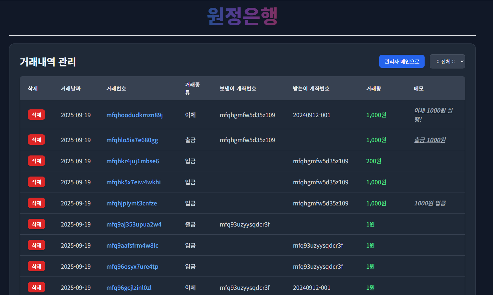

# WonJeong_Bank

## 1. 📌 프로젝트 주제  
vue/express를 활용한 은행 전산 시스템 만들기

## 2. 💡 프로젝트 소개  (개발 기간 : 2025.09.12 ~ 2025.09.19 (1주간))
원정은행은 **은행 전산 시스템의 핵심 기능을 구현한 웹 기반 프로젝트**입니다.  
회원 관리, 계좌 관리, 입출금·이체 처리 등  
실제 금융 시스템의 흐름을 고려하여 설계하고 구현했습니다.

## 3. 🛠 사용 기술
| 분류 | 기술 |
|------|------|
| Frontend |  |
| Backend |   |
| Database |  |
| AI | 

## 4. 🖼️ 기획 및 설계

은행 시스템 구조를 이해하기 위해  
**엑셀을 활용하여 데이터 구조와 페이지 흐름을 먼저 설계**했습니다.

  

  

  

  

  

  

## 5. 📑 페이지별 주요 기능

### 1. 메인화면

로그인, 회원가입, 계좌조회, 예금추가 기능에 접근할 수 있는 메인 페이지입니다.

로그인 후에는 회원정보 조회와 로그아웃 기능에 접근 가능합니다.

관리자인 경우, 관리자 전용 버튼을 통해 관리자 전용 페이지에 접근 가능합니다.

 
  

 

 
  

### 2. 로그인

아이디와 비밀번호가 오라클 DB에 저장된 고객정보와 일치하면 로그인이 가능합니다.

로그인하지 않은 사용자는 은행 서비스에 접근할 수 없습니다.

회원가입이 되어 있지 않은 사용자를 위해 회원가입 버튼을 통해 회원가입 페이지로 바로 이동할 수 있도록 하였습니다.

 
  

### 3. 회원가입

이메일을 제외한 input 태그 안에 값이 하나라도 비어 있으면 회원가입이 불가능하도록 하였습니다.

DB에 이미 존재하는 ID가 있으면 회원가입이 불가능하도록 하였습니다.

이메일을 입력하는 경우 이메일 형식에 맞아야만 회원가입이 가능합니다.

 
  

### 4. 회원정보 조회

일반 고객은 회원정보 수정 버튼과 회원탈퇴 버튼이 보이며, 회원탈퇴 버튼을 통해 탈퇴가 가능합니다.

관리자는 회원탈퇴 버튼에 접근할 수 없습니다.

 
  

 

 
  

 

 
  

### 5. 회원정보 수정

회원정보 수정 화면은 최초 진입 시 회원정보 조회 화면에서 보이던 정보로 값이 채워진 상태로 출력됩니다.

이메일 형식에 유의하여 수정하면 됩니다.

 
  

### 6. 계좌목록 조회

필터 기능을 통해 예금 계좌와 대출 계좌만 선택하여 조회할 수 있습니다.

 
  

### 7. 계좌상세화면

선택한 계좌의 계좌명과 계좌번호, 잔액을 기본적으로 확인할 수 있습니다.

버튼을 통해 이체, 입출금, 계좌명 수정, 예금 해지 기능을 사용할 수 있습니다.

 
  

 

 
  

### 8. 계좌명 수정

기존 계좌명이 입력된 상태로 화면이 출력됩니다.

기존 이름을 삭제한 후 원하는 새 계좌명으로 수정할 수 있습니다.

  

### 9. 입출금

입출금 유형을 선택하고 금액을 입력한 뒤 실행 버튼을 누르면 입출금이 가능합니다.

메모 기능은 기본적인 스타일을 제공합니다.

 
  

 

 
  

### 10. 이체

받는 사람의 계좌번호와 금액을 입력하면 이체가 가능합니다.

메모 기능을 제공합니다.

 
  

### 11. 예금 추가

계좌명과 금액을 입력하면 예금이 추가됩니다.

 
  

### 12. 관리자 전용 페이지

관리자 권한을 가진 사용자만 접근할 수 있습니다.

데이터를 삭제할 수 있으며, 수정 기능은 미구현 상태입니다.

관리자는 목록에 표시되지 않으므로 본인을 삭제할 수 없습니다.

거래내역은 관리자만 삭제할 수 있습니다.

  

 

 
  

 

 
  

## 6. 🎇 프로젝트 후기
본 프로젝트를 통해 은행 전산 시스템의 기본 구조를 이해하고, 이를 직접 설계 및 구현하는 경험을 했습니다. Vue와 Express를 활용하여 프론트엔드와 백엔드 간의 데이터 흐름을 구현하며, 수업 시간에 학습한 CRUD 개념을 실제 서비스 기능으로 적용해 볼 수 있었습니다. 특히 로그인, 계좌 관리, 입출금 및 이체 기능을 구현하면서 사용자 요청에 따른 데이터 처리 과정과 화면 간 흐름을 고려한 설계의 중요성을 느꼈습니다. 또한 기능 구현에 그치지 않고 유지보수와 확장을 고려한 구조를 고민하며 개발을 진행했고, 이를 통해 전체 개발 프로세스를 이해하고 문제 해결 역량을 향상시킬 수 있었습니다.
